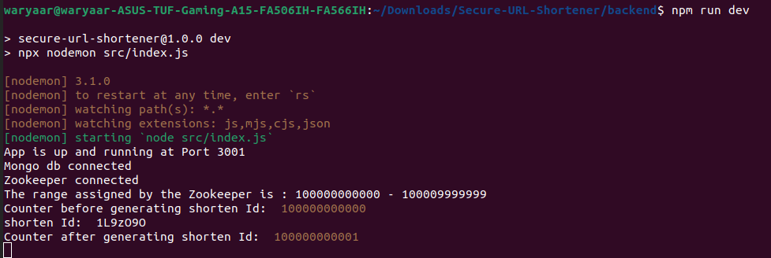
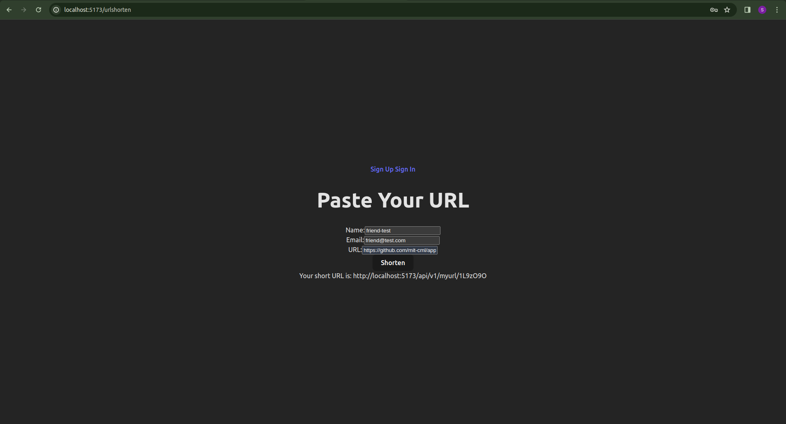

# SecureLink

Scalable URL Shortener with Privacy Controls

This is the repo for the prototype of the project SecureLink.

<h3>Version 2: (with zookeeper) Updated!</h3>

* **Robust ID Generation with Zookeeper:** The application now leverages Zookeeper for distributed coordination, ensuring unique short ID generation across multiple application servers. Each server connects to Zookeeper and receives a unique, unused range for ID allocation.

* **Efficient Base62 Encoding:** Short IDs are generated using a Base62 algorithm.  For each incoming request, the current counter value (within the assigned range) is converted to Base62 format, and the counter is incremented. 

* **Guaranteed Uniqueness:** This approach guarantees the uniqueness of each generated short ID, eliminating the need for database uniqueness checks prior to storage.

* Upon startup, the application server connects to Zookeeper and acquires a unique range for generating shortened URLs. Users requesting shortened URLs receive them from the available range.

<br>



<br>



<br>

---

<h3>Version 1: (without zookeeper)</h3>

* In this version, we have employs a random 7-character, Base62 encoding scheme to generate shortened URLs. 
* Understanding Collision Potential: While this approach generally produces unique IDs, with increasing usage, the probability of collisions exists. A more robust solution is needed for production deployment.

<br>

---
<br>

To run the project locally, run the following commands to download it:
```
git clone https://github.com/SuryaTanwar/Secure-URL-Shortener.git
```

To install the dependencies, run the following command in the root of the frontend and backend:
```
npm install
```

Change the directory and go into the backend folder.
create .env file in the root of backend and frontend and add the following lines with their value:

Backend
```
PORT=
JWT_SECRET=
JWT_EXPIRY=
GMAIL_PASS=
GMAIL_EMAIL=
MONGO_URL=
```
Frontend
```
VITE_BACKEND_HOST=
VITE_FRONTEND_HOST=
```

Setup the Zookeeper with the ranges.

Turn up your MongoDB server.

Go to the root of frontend and backend, turn up both the server through the command,

```
npm run dev
```

For any query, contact me on forsurya02@gmail.com

Here is the demo video of this project: https://youtu.be/fDNjN1bkTpk